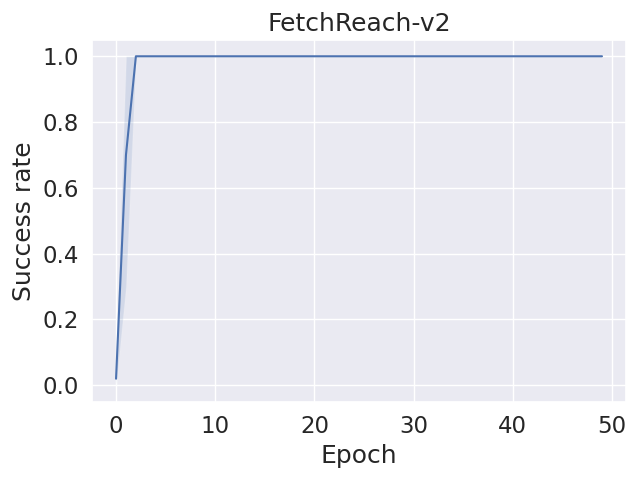
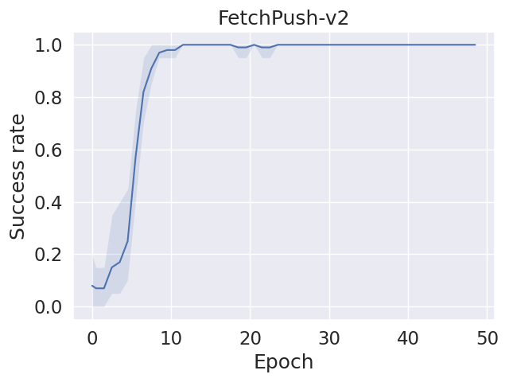
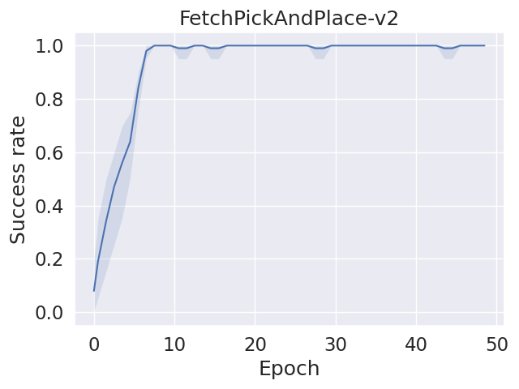
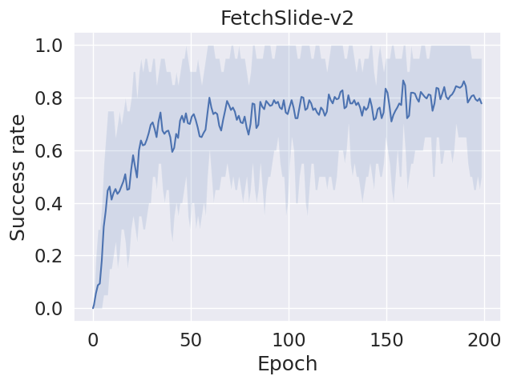
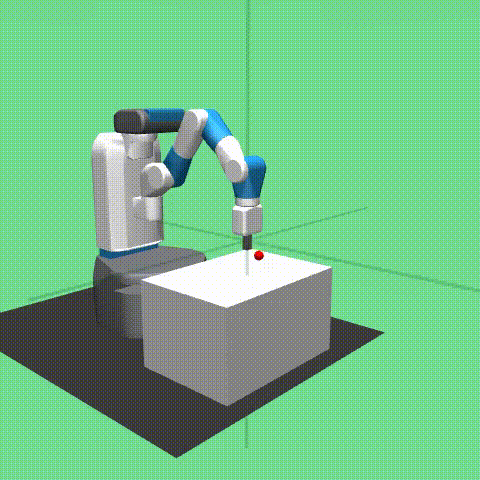
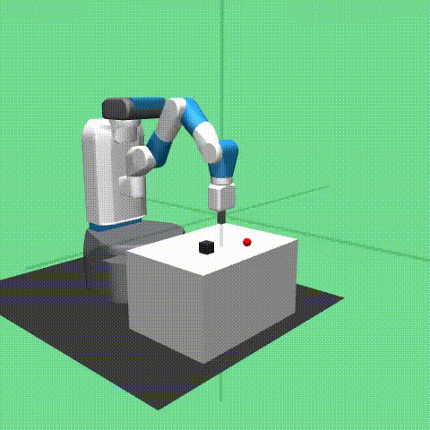

# SAC-HER
SAC+HER for Fetch Robot Tasks

# Soft Actor-Critic (SAC):
SAC is an algorithm that optimizes a stochastic policy in an off-policy manner, serving as a bridge between stochastic policy optimization and DDPG-style (Deep Deterministic Policy Gradient) approaches. While not a direct successor to TD3 (Temporal Difference 3, published roughly concurrently), SAC incorporates the clipped double-Q trick. Due to the inherent stochasticity of the policy in SAC, it also benefits from something akin to target policy smoothing.

One of SAC's central features is entropy regularization. In this context, the policy is trained to maximize a trade-off between the expected return and entropy, which measures the randomness in the policy. This feature is closely tied to the exploration-exploitation trade-off: by increasing entropy, SAC encourages more exploration, potentially accelerating learning in later stages. Moreover, it acts as a preventive measure, guarding against the policy prematurely converging to a suboptimal local solution.

This emphasis on entropy regularization distinguishes SAC from other reinforcement learning algorithms and contributes to its effectiveness in handling continuous action spaces and exploration challenges. The incorporation of exploration through entropy encourages the agent to explore a broader range of actions, facilitating the discovery of more optimal policies. This property is particularly valuable in real-world robotic tasks where exploration is crucial for adapting to diverse environments and improving overall task performance.

# Hindsight Experience Replay (HER):

-  Objective: HER is a technique that addresses the sparse reward problem in reinforcement learning by considering alternative goals for an episode.
-  Key Features:
After an episode, the achieved goal is replaced with the desired goal, turning failures into successes for learning purposes.
This helps in learning from both successful and unsuccessful episodes, improving sample efficiency.

# Combining SAC and HER for Fetch Robot Tasks:

- Training Setup:
Use the SAC algorithm as the base reinforcement learning algorithm.
Incorporate a replay buffer to store experiences for off-policy learning.
Integrate HER into the training process to enhance sample efficiency.

- HER Implementation:
Define a set of goals for each episode, including the original goal and alternative goals.
If the episode is successful, store the experiences in the replay buffer as usual.
If the episode is unsuccessful, store the experiences with the alternative goals in the replay buffer.

- Training Procedure:
Train the SAC algorithm with the augmented replay buffer that includes both successful and unsuccessful episodes.
The algorithm learns from the hindsight experiences, improving its ability to achieve goals in future episodes.

- Benefits:
The combination of SAC and HER helps the robot learn from both successes and failures, making the training process more robust.
HER mitigates the challenge of sparse rewards by providing additional learning signals.

# Results
|_|_|
|:---:|:---:|
| |
| |

# Comparison of Results
|_|_|
|:---:|:---:|
| |
| |

# Demo

Reach| Push|
-----------------------|-----------------------|
| |

Pick And Place | Slide|
-----------------------|-----------------------|
|

# Reference
- SAC: https://arxiv.org/abs/1802.09477
  
- Open AI: https://doi.org/10.48550/arXiv.1707.01495
  
- Environment: https://robotics.farama.org/envs/fetch/

